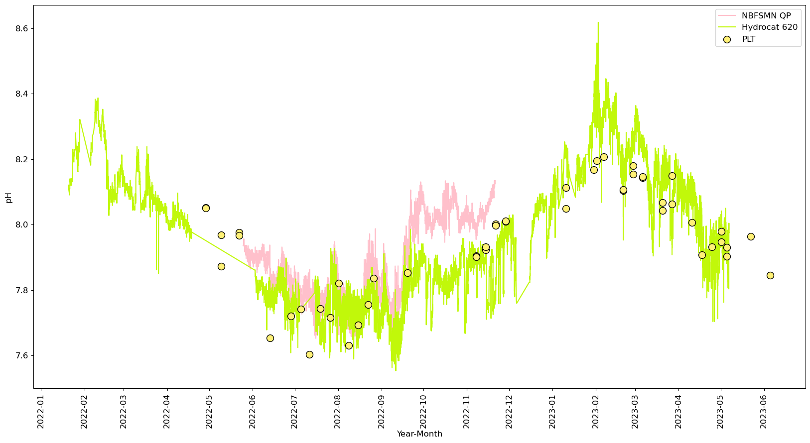
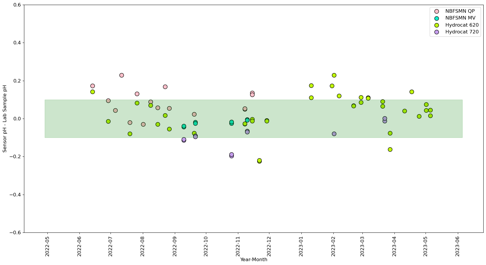

# phyto
Narragansett Bay Long Term Phytoplankton Time Series pH analysis

Most recent analysis can be viewed in `TimeSeriesAnalysis_8May2023.ipynb`.

# Data

* Hydrocat sensors from Davies Lab
* Narragansett Bay Fixed Station Monitoring Network - MV
* Wang Lab SeaFET sensor
* NB Long Term Phytoplankton Time Series Bottle Samples, analyzed by Wang Lab

# Data Retrieval
I've opted to set up [API retrieval for Google sheets](https://towardsdatascience.com/from-google-sheet-to-your-jupyter-notebook-ccdbf28fbf1b). NBFSM data available [here](https://docs.google.com/spreadsheets/d/1m61xkdLMaMSvw533FmVDIBqJqF73QF6b/edit#gid=924440352). Bottle samples availabke [here](https://docs.google.com/spreadsheets/d/17FFbtUuhUS4UtxB-OjKIP2wCYJoEAmaW6VaHQPcup9U/edit#gid=0). Up-to-date SeaFET data is not yet available via Google Sheets.

## `PLT` class

The `PLT` class has a function that ingests Hydrocat sensor data from the Davies lab (`get_hydrocat(start_date, end_date, buoy)`).

# Required Dependencies

* `PyCO2SYS`
* `re`
* `time`
* `pandas`
* `numpy`
* `xarray`
* `requests`
* `datetime`
* `math`
* `gspread` 
* `oauth2client` 
* `df2gspread`
